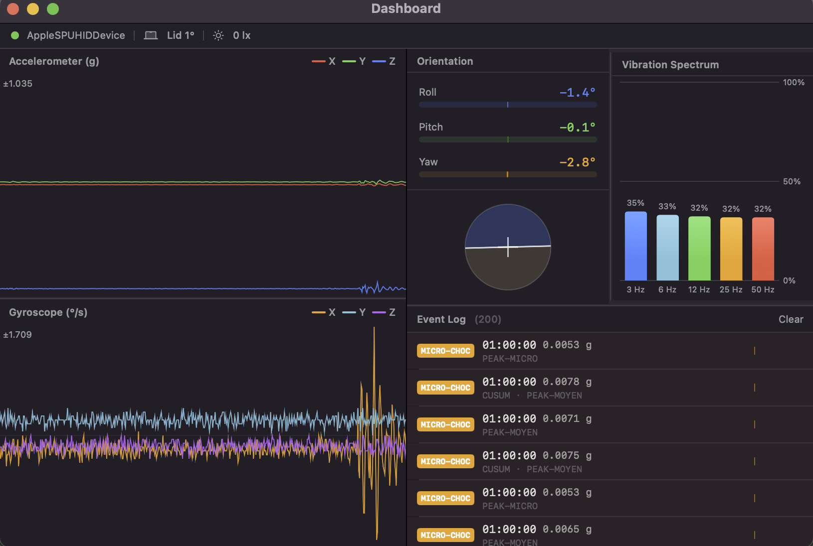

# MacSense

A native SwiftUI macOS app that reads the built-in MEMS IMU (accelerometer + gyroscope), ambient light sensor, and lid-angle sensor of Apple Silicon MacBooks in real time — no root access, no Python runtime, no third-party libraries.

> **Requires:** Apple Silicon MacBook (M1 / M2 / M3 / M4)



---

## Features

- **Accelerometer & Gyroscope** — live 3-axis waveforms at ~100 Hz (8∶1 decimated from ~800 Hz raw)
- **Orientation** — roll / pitch / yaw via Mahony AHRS with quaternion bootstrap
- **Vibration Spectrum** — 5-band IIR energy tracker (3 / 6 / 12 / 25 / 50 Hz)
- **Event Detection** — four parallel algorithms: STA/LTA, CUSUM, Kurtosis, Peak/MAD
- **Ambient Light** — calibrated lux + 4-channel raw photodetector counts
- **Lid Angle** — hinge opening angle in degrees
- **Menu Bar** — live sparkline / value display, compact popup, configurable display mode

---

## Requirements

| | |
|---|---|
| Hardware | Apple Silicon MacBook (M1 / M2 / M3 / M4) |
| macOS | 14.0 Sonoma or later |
| Xcode | 15.0 or later |
| Sandbox | Disabled (required for IOKit HID access) |
| Permission | Input Monitoring — System Settings → Privacy & Security → Input Monitoring |

---

## Build

```bash
xcodebuild -project apple-motion.xcodeproj -scheme apple-motion -destination "platform=macOS" build
```

Or open `apple-motion.xcodeproj` in Xcode and press **⌘R**.

On first launch, grant **Input Monitoring** permission when prompted, then relaunch.

---

## TODO

- [ ] Reduce CPU usage
- [ ] Support configurable thresholds for each detector parameter to reduce noise

---

## Credits

Based on [olvvier/apple-silicon-accelerometer](https://github.com/olvvier/apple-silicon-accelerometer) — sensor access method and HID report format derived from that Python reference implementation.
